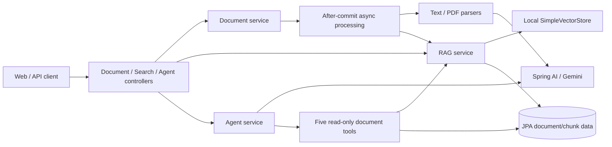

# SmartDoc-JP — Spring AI / Gemini Document Assistant

##  概要 (Project Overview)
**「ドキュメント管理を、もっとスマートに。」**
Java 21、Spring Boot 3.4.1、Spring AI と Google Gemini の連携により、アップロードされた文書の自動要約、ユーザー単位のローカル RAG 検索、出典付き Q&A、SSE 応答、および読み取り専用の文書 Tool Calling を提供する個人開発プロジェクトです。

日本のIT現場における「ドキュメント整理の繁雑さ」という課題を解決するために開発しました。

> **開発期間**: 約20日間
> **担当**: バックエンド設計・開発、API連携、テスト実装（個人開発）

---

## 主な機能 (Key Features)
### 1. インテリジェントな文書解析 (AI Summarization)
- アップロードされた以下の形式のファイルを自動解析し、要約を生成します。

- 対応フォーマット: `.txt`, `.md`, `.java`, `.pdf`。アップロード時にファイル名と拡張子を確認し、非対応形式は保存前に HTTP 400 で拒否します。拡張子の確認はファイル内容の検証ではありません。

- PDF は `application/pdf` media として Gemini に渡し、テキスト系ファイルとともに要約処理を行います。実 Gemini による OCR、図表理解、品質、速度は現在のテストでは評価していません。

### 2. ローカル RAG と出典付き Q&A

- 文書を分割して Spring AI `SimpleVectorStore` に保存し、認証ユーザーの所有範囲で検索します。
- Q&A 応答には検索元文書の情報を付与します。
- 現在のファイルベース vector store はローカルデモ向けであり、分散構成や本番規模を示すものではありません。

### 3. Agent Tool Calling と SSE

- 文書検索、詳細取得、最近の文書、統計、比較の 5 つの読み取り専用 `@Tool` を登録しています。
- Tool のユーザー範囲はサーバー側コンテキストから決定し、失敗は構造化され、内部情報を含まない結果として返します。
- Web 応答は名前付き `token`、`complete`、`error` SSE event と待機中の `heartbeat` comment を使用します。再接続や負荷時の信頼性は未検証です。

### 4. データ操作と論理削除 (CRUD & Logical Deletion)
- ドキュメントの参照、更新、削除の基本機能。

- 論理削除 (Logical Deletion): データベースから即時に物理削除せず、削除状態を保持します。独立した監査証跡システムを実装しているという意味ではありません。

- 回収箱の文書は所有者または管理者が `POST /api/documents/{id}/restore` で復元できます。元ファイルが残っている場合に HTTP 202 を返し、要約と RAG 索引を非同期で再生成します。処理完了までは検索可能とは限りません。

- Web 画面では認証済み API から文書一覧と回収箱を読み込み、文書を回収箱へ移動または復元できます。処理中の文書は画面から削除できません。

- HTTP コントローラーの主要な例外は `GlobalExceptionHandler` で処理し、リクエスト検証失敗時は構造化された RFC 7807 Problem Details を返します。バックグラウンド処理はライフサイクル状態として成功・失敗を記録します。例外処理全体が完全に脱機密化されているという意味ではありません。

##  技術スタック (Tech Stack)
現在のビルドとコンテナ設定は Java 21 を使用します。

- **Language**: Java 21
- **Framework**: Spring Boot 3.4.1
- **AI Integration**: Google Gemini 2.5-flash (Spring AI)
- **Build Tool**: Maven
- **Database**: MySQL 8.0
- **Version Control**: Git / GitHub

---

##  アーキテクチャ (Architecture)
文書管理、非同期解析、RAG、Agent をサービス境界で分離しています。

---

##  工夫した点・苦労した点 (Points of Ingenuity & Challenges)

### 1. 運用を意識したログ設計 (AOP Implementation)
開発当初、ログ出力が散在しデバッグが困難でした。これを解決するために **Spring AOP (Aspect Oriented Programming)** を導入しました。

* サービス層のメソッド実行について、クラス名、メソッド名、処理時間を横断的に記録する仕組みを構築。
* ビジネスロジックから横断的なログと処理時間計測を分離しています。ログやメトリクスが本番可観測性を保証するという意味ではありません。

### 2. 外部API連携と依存関係の管理 (API Integration & Dependency Management)
**Gemini API** の統合において、レスポンスの遅延や形式の不一致に直面しました。

* 60 秒の HTTP タイムアウト、再試行、失敗時の状態遷移を実装しました。新規処理の summary fallback と非同期処理失敗は固定の安全な文言を保存し、例外詳細はクライアントへ返しません。旧バージョンが保存した既存行には別途クリーンアップ方針が必要です。実 Gemini の可用性・レイテンシ・品質は環境依存であり、別途 live smoke が必要です。
* また、**Java 21** と **Spring Boot 3.4.1** の組み合わせにおける依存関係（Dependencies）の競合を解消し、モダンな開発環境を整えました。

### 3. 設計思想へのこだわり (Architectural Design)
単に動くコードを書くのではなく、将来の拡張性を考慮し、機能ごとにクラスの責務を明確に分離しました。

---

## 環境構築 (Setup)

Dockerfile と Docker Compose 設定を提供しています。Docker/Linux での実行証跡は環境ごとに確認が必要です。

リポジトリをクローン:

      git clone https://github.com/zzxnumberthree/SmartDoc.git

1. API キーとローカル環境変数の設定

[Google AI Studio](https://aistudio.google.com/) にアクセスし、無料の API キーを取得してください。

      cp .env.example .env

`.env` 内の `GOOGLE_API_KEY`、`DB_ROOT_PASSWORD`、`DB_PASSWORD`、`JWT_SECRET` を実際の値に置き換えてください。`.env` は Git の追跡対象外です。

2. アプリケーションの起動

      cd SmartDoc
      docker compose config --quiet
      docker compose up --build --detach --wait
      curl --fail http://localhost:8080/actuator/health

Linux で実 API を含む Compose smoke を実行する場合は、`.env` の値を現在の shell に export した上で次を実行します（`curl` と `jq` が必要です）。

      set -a
      source .env
      set +a
      bash scripts/compose-smoke.sh

この smoke は毎回独立した Compose project と新規 volume を使用し、health、認証、非同期アップロード、RAG、grounded Q&A、複数 SSE frame、および app 再起動後のデータ保持を確認してから一時 stack を削除します。調査のため保持する場合のみ `bash scripts/compose-smoke.sh --keep` を使用してください。

旧 Compose 設定で作成済みの `db_data` volume には、過去の `data.sql` による `admin_user_1` が残っている可能性があります。アップグレード時は当該ユーザーを監査し、必要に応じてパスワード変更または削除を行ってください。新設定は seed data を実行しませんが、既存データを自動削除もしません。

現在の能力境界は `docs/PROJECT_CONTEXT.md`、再現可能なテスト手順と各テスト階層の限界は `docs/TESTING.md` を参照してください。

---

## Connect With Me
email:  zzxnumberthree@gmail.com

