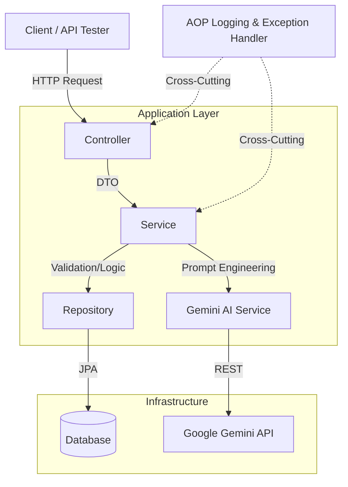

# AI Smart Document Management System (AI-SDMS)

##  概要 (Project Overview)
**「ドキュメント管理を、もっとスマートに。」**
Spring Boot 3とGoogle Gemini APIを活用し、 単なるファイルの保存・削除にとどまらず、アップロードされた技術文書の内容を AI が自動的に解析し、要約を生成することで、情報の検索性と管理効率を劇的に向上させます。 「2025年の崖」と呼ばれるDX（デジタルトランスフォーメーション）の課題解決を意識して開発しました。

日本のIT現場における「ドキュメント整理の繁雑さ」という課題を解決するために開発しました。

> **開発期間**: 約20日間
> **担当**: バックエンド設計・開発、API連携、テスト実装（個人開発）

---

## 主な機能 (Key Features)
### 1. インテリジェントな文書解析 (AI Summarization)
- アップロードされた以下の形式のファイルを自動解析し、要約を生成します。

- 対応フォーマット: .txt, .pdf, .md ...

- 特長: Spring AI を活用した堅牢なプロンプトエンジニアリングと Gemini 2.5-flash による高速な推論。

### 2. 安全で堅牢なデータ操作 (Robust CRUD & Logical Deletion)
- ドキュメントの参照、更新、削除の基本機能。

- 論理削除 (Logical Deletion): データの安全性と監査（監査証跡）を考慮し、データベースからの物理削除ではなく論理削除を実装。

- 一貫したエラーハンドリング: 独自の GlobalExceptionHandler により、予期せぬエラーやバリデーション違反も適切な形式で返却します。

##  技術スタック (Tech Stack)
最新のLTSバージョンを採用し、保守性とパフォーマンスを意識した選定を行いました。

- **Language**: Java 21
- **Framework**: Spring Boot 3.4.1
- **AI Integration**: Google Gemini 2.5-flash (Spring AI)
- **Build Tool**: Maven
- **Database**: MySQL 8.0
- **Version Control**: Git / GitHub

---

##  アーキテクチャ (Architecture)
保守性を高めるため、責任の分離（Separation of Concerns）を意識したレイヤードアーキテクチャを採用しています。

---

##  工夫した点・苦労した点 (Points of Ingenuity & Challenges)

### 1. 運用を意識したログ設計 (AOP Implementation)
開発当初、ログ出力が散在しデバッグが困難でした。これを解決するために **Spring AOP (Aspect Oriented Programming)** を導入しました。

* コントローラー層やサービス層のメソッド実行前後で、自動的にリクエスト情報や処理時間をログ出力する仕組みを構築。
* これにより、ビジネスロジックを汚すことなく、**トレーサビリティ（追跡可能性）**を大幅に向上させました。

### 2. 外部API連携と依存関係の管理 (API Integration & Dependency Management)
**Gemini API** の統合において、レスポンスの遅延や形式の不一致に直面しました。

* 60 秒の HTTP タイムアウト、再試行、フォールバック状態を実装しました。実 Gemini の可用性・レイテンシ・品質は環境依存であり、別途 live smoke が必要です。
* また、**Java 21** と **Spring Boot 3.4.1** の組み合わせにおける依存関係（Dependencies）の競合を解消し、モダンな開発環境を整えました。

### 3. 設計思想へのこだわり (Architectural Design)
単に動くコードを書くのではなく、将来の拡張性を考慮し、機能ごとにクラスの責務を明確に分離しました。

---

## 環境構築 (Setup)

Dockerfile と Docker Compose 設定を提供しています。Docker/Linux での実行証跡は環境ごとに確認が必要です。

リポジトリをクローン: 

      git clone https://github.com/zzxnumberthree/SmartDoc.git

1. API キーとローカル環境変数の設定

[Google AI Studio](https://aistudio.google.com/) にアクセスし、無料の API キーを取得してください。

      cp .env.example .env

`.env` 内の `GOOGLE_API_KEY`、`DB_ROOT_PASSWORD`、`DB_PASSWORD`、`JWT_SECRET` を実際の値に置き換えてください。`.env` は Git の追跡対象外です。

2. アプリケーションの起動

      cd SmartDoc
      docker compose config --quiet
      docker compose up --build --detach --wait
      curl --fail http://localhost:8080/actuator/health

Linux で実 API を含む Compose smoke を実行する場合は、`.env` の値を現在の shell に export した上で次を実行します（`curl` と `jq` が必要です）。

      set -a
      source .env
      set +a
      bash scripts/compose-smoke.sh

この smoke は毎回独立した Compose project と新規 volume を使用し、health、認証、非同期アップロード、RAG、grounded Q&A、複数 SSE frame、および app 再起動後のデータ保持を確認してから一時 stack を削除します。調査のため保持する場合のみ `bash scripts/compose-smoke.sh --keep` を使用してください。

旧 Compose 設定で作成済みの `db_data` volume には、過去の `data.sql` による `admin_user_1` が残っている可能性があります。アップグレード時は当該ユーザーを監査し、必要に応じてパスワード変更または削除を行ってください。新設定は seed data を実行しませんが、既存データを自動削除もしません。

テスト階層と各証跡の限界は `docs/TESTING.md` を参照してください。

---

## Connect With Me
email:  zzxnumberthree@gmail.com

