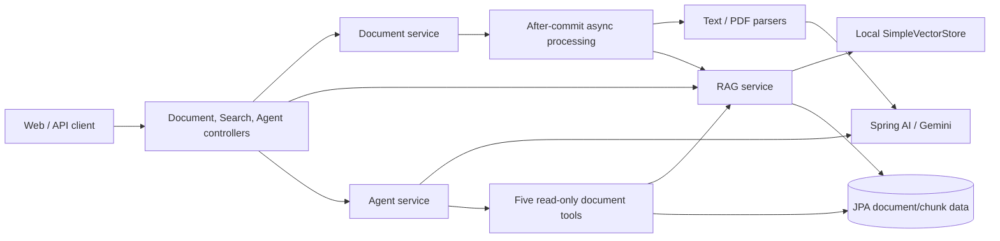

# SmartDoc-JP Project Context

Last synchronized: 2026-09-24 (Asia/Tokyo)

## Purpose

This file is the lightweight routing page for the repository's current product and engineering context. It is not the user's resume and does not require resume or interview artifacts to be kept in sync during normal development.

Current project positioning:

> A Java 21 and Spring Boot document assistant that integrates Spring AI with Google Gemini for PDF/text summarization, owner-isolated local RAG, cited question answering, named SSE streaming, and five read-only document tools.

This positioning describes implemented application behavior. It does not imply production scale, measured performance, provider quality, or autonomous planning.

## Daily development context

Use only the smallest relevant set:

1. `AGENTS.md` — repository working and safety rules.
2. `docs/PROJECT_CONTEXT.md` — current project boundary and context routing.
3. `docs/TESTING.md` — reproducible commands and the proof boundary of each test tier.
4. `README.md` — public usage and project introduction when user-visible behavior is relevant.

Source code and reproducible tests are authoritative for implemented behavior. This file summarizes the current boundary; `docs/TESTING.md` owns test commands and verification scope. Test counts and environment results are snapshots, not permanent guarantees.

## Current capability boundary

| Area | Demonstrable scope | Evidence boundary |
|---|---|---|
| Runtime | Java 21, Spring Boot 3.4.1 | Verified by Maven build/test on the current Windows host |
| AI integration | Spring AI with configured Gemini 2.5 Flash chat and embedding paths | Deterministic tests verify application wiring; live Gemini behavior is not currently executed evidence |
| PDF input | PDF is sent to the model as `application/pdf` media | Does not prove OCR, chart understanding, visual accuracy, or multi-source fusion |
| Summarization | Upload schedules automatic PDF/text summary generation; a typed internal result separates success/failure from fixed safe fallback text | Whole-input, free-form summary; no quality or long-context evaluation; protected server logs retain exception causes; legacy rows written by older versions require an explicit cleanup policy |
| Async processing | After-commit scheduling through a Spring-managed task executor | Feature behavior is tested; saturation can still fall back to the request thread through `CallerRunsPolicy` |
| RAG and Q&A | Owner-filtered local `SimpleVectorStore`, persisted chunks, cited answers | Local/demo-grade durability; deterministic model and H2 are used by default tests |
| Recycle-bin restore | Owner or admin can restore a soft-deleted document with a retained source file; HTTP 202 schedules summary and RAG rebuild after commit; Web UI lists active/deleted documents with delete/restore controls | H2 integration tests verify scope, file checks, state change, and async scheduling; browser behavior, rebuild completion, and MySQL behavior are not proven by this operation's tests |
| Original download | Owner or admin can download an active document as an attachment; stored path checks reject missing and escaping files | H2/MockMvc tests verify bytes, headers, scope, and failure responses; no real browser or MySQL download proof |
| Streaming | Named `token`, `complete`, and `error` SSE events, and transport SSE comment heartbeats; POST Web client with buffered parsing | Deterministic unit/contract tests verify event mapping, heartbeats, and timeout/cancellation cleanup; no browser, reconnect, or load proof |
| Tool Calling | Five owner-scoped, read-only Spring AI `@Tool` functions with structured failure results | One deterministic provider-selected synchronous callback; no autonomous planner or multi-tool workflow proof |
| API validation | Request validation failures return HTTP 400 RFC 7807 Problem Details with safe generic detail and structured field errors without rejected values | Audited controller validation paths only; does not prove application-wide error de-identification or full OpenAPI schema conformance |
| Tests | Deterministic default suite plus separate optional integration/live tiers | Current commands and retained results live in `docs/TESTING.md` and `docs/demo-results/`; no coverage gate |
| Container delivery | Dockerfile, Compose configuration, health checks, and a smoke script exist | No successful Docker/Linux/MySQL runtime execution is retained from the current host |

## Explicitly out of scope as current capabilities

The following are not current SmartDoc-JP capabilities and must not be inferred from dependencies, status fields, design notes, or future plans:

- Redis caching
- A formal finite-state machine
- Autonomous Task Planning or a planner/executor loop
- Robotics or autonomous control
- A 30x speed improvement
- End-to-end inference/query latency below 200 ms
- Proven high-concurrency or production reliability
- Test coverage of 90% or higher
- Verified OCR, chart reasoning, or multi-source multimodal fusion

These items move into the current capability table only after implementation plus relevant reproducible verification. Resume wording is a separate, explicitly requested task.

## Architecture entry points



Authorization context is derived server-side. Document repository queries, RAG metadata filtering, Agent tools, and chat-memory keys are scoped by the authenticated user in the audited paths.

## Verification snapshot

Executed on the current Windows host:

```powershell
.\mvnw.cmd clean verify
```

The latest retained Windows verification covers the deterministic default tier with H2 in MySQL compatibility mode and deterministic AI provider doubles; it does not execute the optional `*IT` classes. Exact run counts and coverage values are intentionally kept out of this routing page.

The coverage command, counters, scope, and repeat-run result are retained in `docs/demo-results/2026-09-18-api-contract-coverage.md`. The measurement is not a coverage gate.

Prepared but not successfully executed as runtime proof on this host:

- MySQL 8 Testcontainers scenarios: Docker unavailable; two optional scenarios were skipped.
- Live Gemini smoke: not enabled or executed.
- Docker Compose/Linux smoke: script/configuration present; runtime workflow not executed.
- Coverage gate: no enforced threshold; no Linux CI coverage run.

See `docs/TESTING.md` for exact commands and limitations.

## Context maintenance policy

- Routine implementation work updates source code and relevant tests first.
- Update this file only when the capability boundary, architecture entry points, verification boundary, or current engineering priorities materially change.
- Update `docs/TESTING.md` when commands or test-tier semantics change, and update `README.md` when user-visible setup or behavior changes.
- Do not update resume, interview, audit, or retained-result documents unless the user explicitly requests that work or a release/interview snapshot is being prepared.
- Keep volatile run details in `docs/demo-results/` instead of copying them into every context document.

## Completed positioning decision

Route A is complete: the project is positioned narrowly as the Spring AI/Gemini document assistant described at the top of this file. Redis, FSM, autonomous planning, robotics, unmeasured performance, high-concurrency, reliability, and 90%+ coverage claims are not part of the current product scope. This is a settled boundary, not an active resume-synchronization plan.

## Optional portfolio, historical, and research material

The following may contain alternatives, market research, ideal architectures, or superseded recommendations and do not prove current implementation:

- `.agents/**`
- `docs/RESUME_TARGET.md`
- `docs/RESUME_EVIDENCE.md`
- `docs/INTERVIEW_DEMO.md`
- `docs/market_research/**`, when present
- `docs/superpowers/plans/**`, when present

These files are not part of the daily development context and do not need routine synchronization. Terms appearing only in them—such as LangGraph, Langfuse, Ragas, HITL, checkpoint/time-travel workflows, enterprise approval agents, or robotics—must not be attributed to the current application.
